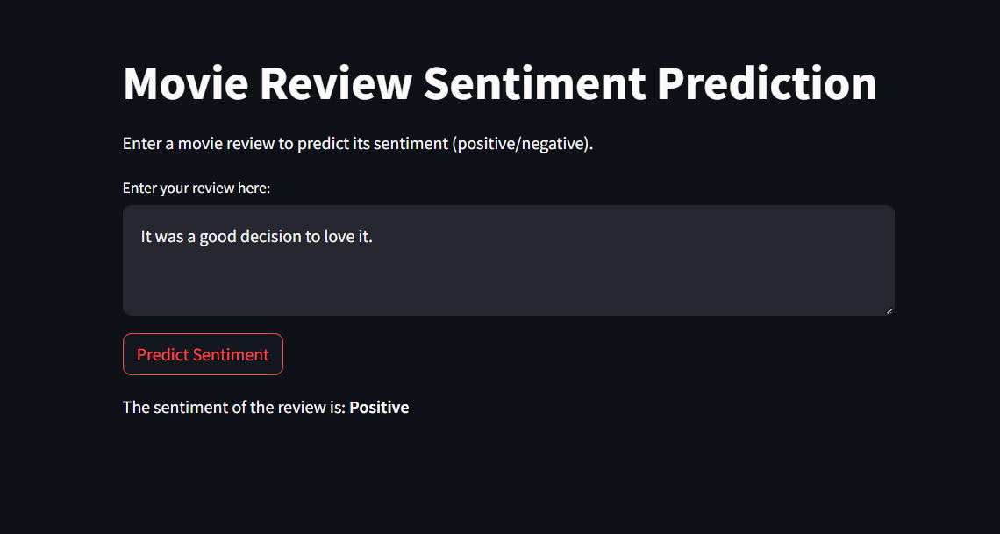
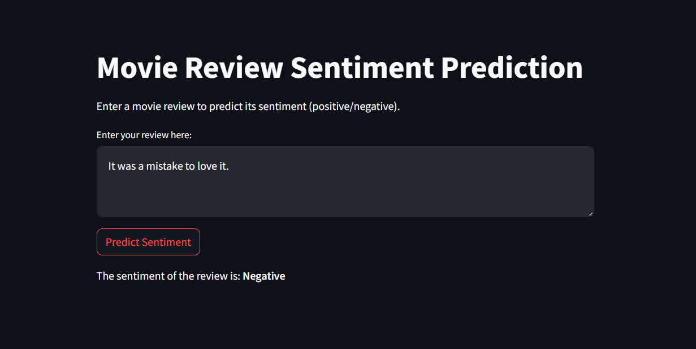

# Sentiment Prediction of Reviews using IMDB dataset

## Introduction
This project is about predicting the sentiment of reviews using the IMDB dataset. The dataset contains 50,000 reviews, which are divided into 25,000 reviews for training and 25,000 reviews for testing. The reviews are labeled as positive or negative. The goal of this project is to predict the sentiment of the reviews using machine learning algorithms.

## Data
The dataset contains 50,000 reviews, which are divided into 25,000 positive reviews and 25,000 negative reviews. The reviews are labeled as positive or negative. The dataset is available at [IMDB dataset](https://ai.stanford.edu/~amaas/data/sentiment/).

## Methodology
The methodology used in this project is as follows:
1. Data Preprocessing
2. Model Building
3. Model Evaluation

## WANT TO RUN THE APP LOCALLY?
1. Clone the repository: `git clone https://github.com/pragya-02/reviews-sentiment-prediction.git`
2. Navigate to the project directory: `cd reviews-sentiment-prediction`
3. Install the required libraries.
4. Run the app: `streamlit run app.py`

## Demo

### Positive Review

### Negative Review
